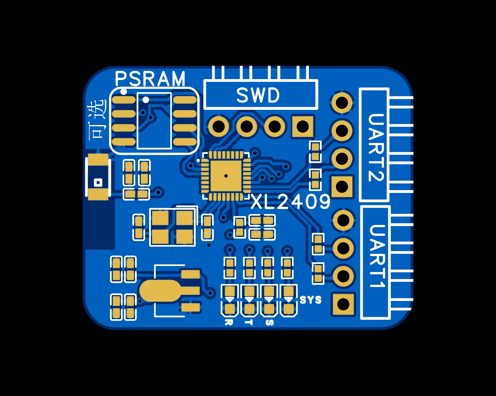

# 开发工具

采用立创EDA(专业版)作为PCB设计工具,官网地址:[https://pro.lceda.cn/](https://pro.lceda.cn/)

# 说明

对于模块而言，硬件设计仅供参考(可能并不是最优设计(尤其是无线部分)，仅用于验证原理),主要用于验证固件代码。

实际设计时，相关电路应当直接嵌入目标PCB中。

# 文件说明

## 2025-06-06

### 立创EDA(专业版)工程

[ProPrj_ExtModule-003_2025-06-06.epro](ProPrj_ExtModule-003_2025-06-06.epro)

### 原理图

[SCH_ExtModule-003_2025-06-06.pdf](SCH_ExtModule-003_2025-06-06.pdf)

注意:具体原理图请查看立创EDA(专业版)工程。

### PCB

注意:具体PCB板请查看立创EDA(专业版)工程。